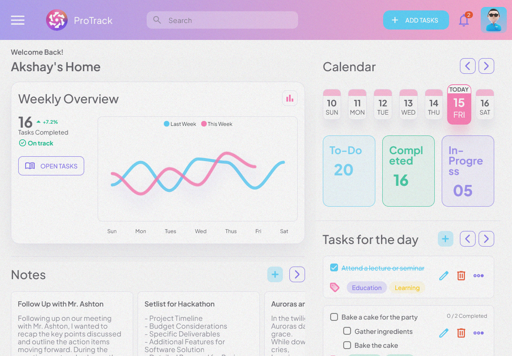

# ProTrack (pro-track)

A (pro) Tracking system for your tasks/to-do

### Some Screen shots:
#### Desktop


<a name="settings-menu"></a>


#### iPad



#### Mobile


<br /><br /><br />
---
> ## Notes:
> - This is a demo dashboard, and it **DOES NOT** use any backend.
> - All data is **generated randomly** on first load and stored in the browser's local storage and maintained the same until local storage is cleared.
> - If you want to generated new random data, you can <ins>*clear the local storage and reload the page*</ins> **OR** <ins>*click on the "[Settings](#settings-menu)" button in user profile displayed at the bottom of the left sidebar and then click on "[New Data](#settings-menu)" button from the popover menu*</ins>.


<br /><br /><br /><br />
---
## Install the dependencies
```bash
yarn
# or
npm install
```

### Start the app in development mode (hot-code reloading, error reporting, etc.)
```bash
quasar dev
```


### Lint the files
```bash
yarn lint
# or
npm run lint
```


### Format the files
```bash
yarn format
# or
npm run format
```


### Build the app for production
```bash
quasar build
```

### Customize the configuration
See [Configuring quasar.config.js](https://v2.quasar.dev/quasar-cli-vite/quasar-config-js).


<br /><br /><br /><br />

---
## Design Credit:
[Raahida Kalami](https://in.linkedin.com/in/raahida-kalami-041002raah) → [Figma Design](https://www.figma.com/design/2n42N63thKhQh9dqg5Z0HT/Design-Challenge)
